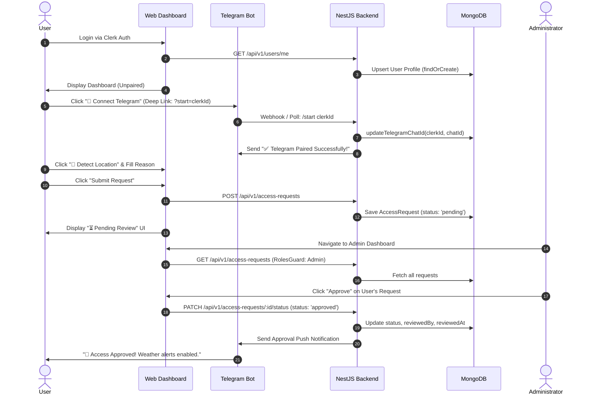

# WeatherGuard Admin 🛡️🌤️

<div align="center">
  <h3>Enterprise Full-Stack Weather Alerting & Subscription Management Platform</h3>
  <p>A high-performance Next.js web application and NestJS API gateway providing automated, hyper-local weather alerts via Telegram with an instant deep-link pairing mechanism and robust Role-Based Access Control (RBAC).</p>
</div>

---

[](https://nextjs.org/)
[](https://react.dev/)
[](https://tailwindcss.com/)
[](https://nestjs.com/)
[](https://clerk.com/)
[](https://www.mongodb.com/)
[](https://www.typescriptlang.org/)

---

## 📋 Table of Contents

- [Project Overview](#project-overview)
- [Frontend Architecture & Features](#frontend-architecture--features)
- [Backend Architecture & Features](#backend-architecture--features)
- [Tech Stack](#tech-stack)
- [System Architecture & Data Flow](#system-architecture--data-flow)
- [Database Schema Design](#database-schema-design)
- [Authentication & Authorization Flow](#authentication--authorization-flow)
- [Access Approval Workflow](#access-approval-workflow)
- [Telegram Integration & Deep Linking](#telegram-integration--deep-linking)
- [Weather Alert Scheduler](#weather-alert-scheduler)
- [API Documentation](#api-documentation)
- [Project Structure](#project-structure)
- [Security Considerations](#security-considerations)
- [Quick Start & Setup Instructions](#quick-start--setup-instructions)
  - [Backend Setup](#backend-setup)
  - [Frontend Setup](#frontend-setup)
  - [Environment Variables](#environment-variables)
- [Deployment](#deployment)
- [Screenshots](#screenshots)
- [Assessment Highlights](#assessment-highlights)

---

## Project Overview

**WeatherGuard Admin** solves a critical business problem for enterprise operations reliant on real-time meteorological conditions—such as agriculture, aviation, event management, and logistics—by automating hyper-local weather updates directly to field staff and stakeholders via Telegram.

To protect API quotas and ensure strict security, WeatherGuard implements a rigorous gatekeeping mechanism. Users sign in via a highly optimized Next.js frontend, pair their Telegram account instantly via a one-click deep link, use browser geolocation to capture precise coordinates, and submit an access justification. Administrators review, approve, or reject requests through an advanced administrative dashboard. Once approved, a distributed NestJS microservice schedules and dispatches personalized daily weather alerts directly to the user's Telegram app.

---

## Frontend Architecture & Features

The frontend is architected using the **Next.js App Router**, balancing Server Components (for maximum performance and SEO) and Client Components (for deep interactivity).

### 1. Modern UI & Design System
- **Tailwind CSS & Lucide React:** Built upon a bespoke utility-first design system featuring rich dark/light mode aesthetics, glassmorphism card layouts (`bg-surface-2`), and sleek micro-animations (`animate-fade-in-up`).
- **Responsive Layouts:** Flawless visual flow across mobile, tablet, and ultra-wide desktop viewports.
- **Tailored Typography & Color Palette:** Implements a strict color hierarchy using HSL tokens for surfaces, borders, and vibrant accent states (`accent-500`).

### 2. Deep Linking & Live Status UI
- **One-Click Telegram Pairing (`RequestForm.tsx`):** Completely eliminates manual Chat ID input. Displays a dynamic button (`https://t.me/<bot>?start=<clerkId>`) that instantly launches Telegram to pair the user's account.
- **Real-Time Pairing Badge:** Implements live pairing verification (`✅ Telegram Connected`) alongside a `🔄 Refresh Status` trigger, instantly reflecting server-side webhook updates without requiring a page reload.

### 3. Advanced Browser Geolocation
- **HTML5 Geolocation Integration:** Users click `📍 Detect` to query the browser's native location engine, capturing precise latitude/longitude coordinates (`e.g. 51.5072,-0.1276`) instantly.
- **Graceful Fallback:** Includes error boundaries and manual input override if browser location permissions are denied.

### 4. Custom React Hooks (`_hooks/`)
- **`useAccessRequest.ts`:** Encapsulates the complete user lifecycle state, fetching both the active subscription request (`getMyRequest`) and the live user profile (`getMyProfile`) concurrently.
- **`useAdminRequests.ts`:** Powers the admin moderation table, handling asynchronous list fetching, real-time status mutations (`Approve` / `Reject`), and optimistic UI updates.

### 5. Centralized API Client (`_lib/client.ts`)
- An elegant, type-safe fetch wrapper (`apiClient`) that automatically injects Clerk Bearer JWTs, manages HTTP error serialization, and parses JSON responses into strict TypeScript interfaces.

---

## Backend Architecture & Features

The backend is built on **NestJS**, structured around standalone domain modules to ensure clean separation of concerns and flawless horizontal scalability.

### 1. Robust Gatekeeping API
- **Automatic User Upsertion:** When the frontend queries `GET /api/v1/users/me`, the backend inspects MongoDB and automatically fetches Clerk profile metadata (primary email, name) to execute a `findOrCreate` upsert routine.
- **Single Active Request Lock:** Prevents user spam by restricting accounts to a single active `pending` or `approved` request at any given time.

### 2. Role-Based Access Control (RBAC)
- **Multi-Tier Guard Verification:** Implements `ClerkAuthGuard` to cryptographically verify incoming JWTs via Clerk's backend SDK, alongside `RolesGuard` to match user IDs against secure server environment whitelists (`ADMIN_USER_IDS`).

### 3. Automated Weather Cron Engine (`@nestjs/schedule`)
- **Fault-Tolerant Daily Execution:** Every morning at 8:00 AM, the scheduler queries MongoDB for `approved` users, retrieves their dynamic coordinates, fetches telemetry from WeatherAPI.com, and dispatches rich HTML Telegram alerts.
- **Isolated Error Handling:** Wraps each subscriber alert in an independent try/catch block so an invalid location or blocked bot does not interrupt the rest of the batch.
- **Standalone Trigger CLI:** Includes `trigger.ts`, allowing administrators to manually force-execute weather broadcasts instantly via the terminal.

---

## Tech Stack

| Layer | Technology | Purpose / Role |
| :--- | :--- | :--- |
| **Frontend Framework** | Next.js (App Router), React 18 | High-performance full-stack React framework |
| **Styling & Icons** | Tailwind CSS, Lucide React | Clean, responsive utility-first design system |
| **State & Fetching** | Custom React Hooks, native `fetch` | Dedicated encapsulation of UI state and network requests |
| **Backend Framework** | NestJS (TypeScript) | Enterprise-grade, modular Node.js API framework |
| **Database** | MongoDB Atlas & Mongoose | Highly scalable document database with strict Object-Data Modeling |
| **Authentication** | Clerk (`@clerk/nextjs`, `@clerk/backend`) | High-security user identity and session management |
| **Background Cron** | `@nestjs/schedule` | Automated background execution engine |
| **Third-Party APIs** | Telegram Bot API, WeatherAPI.com | Push messaging delivery network and live meteorological data |

---

## System Architecture & Data Flow

```
+-----------------------------------------------------------------------+
|                           FRONTEND LAYER                              |
|           Next.js 14 App Router | Tailwind CSS | React Hooks          |
+-----------------------------------------------------------------------+
         |                                                     |
  (REST / HTTPS)                                         (Deep Link)
         |                                                     |
         v                                                     v
+-----------------------------------+        +--------------------------+
|             API LAYER             |        |    TELEGRAM ECOSYSTEM    |
|    ClerkAuthGuard | RolesGuard    |        |   node-telegram-bot-api  |
+-----------------------------------+        +--------------------------+
         |                                                     |
         +--------------------------+--------------------------+
                                    |
                                    v
+-----------------------------------------------------------------------+
|                      BUSINESS LOGIC LAYER (NestJS)                    |
|       AccessRequestsService | UsersService | WeatherService           |
+-----------------------------------------------------------------------+
         |                                                     |
     (Mongoose)                                           (Axios / HTTP)
         |                                                     |
         v                                                     v
+-----------------------------------+        +--------------------------+
|          DATABASE LAYER           |        |    EXTERNAL SERVICES     |
|         MongoDB Atlas             |        |      WeatherAPI.com      |
+-----------------------------------+        +--------------------------+
```

### Guaranteed Gatekeeping Mechanism
The system guarantees that **only approved users** receive automated weather alerts through a non-circumventable filtering pipeline:
1. **Unmodifiable Status Property:** When a user submits `POST /api/v1/access-requests`, `CreateAccessRequestDto` strictly excludes the `status` field. The backend service forcefully overrides and sets every new record to `status: 'pending'`.
2. **Isolated Mutation Endpoint:** The only mechanism capable of shifting `status` to `'approved'` is `PATCH /api/v1/access-requests/:id/status`. This endpoint is strictly protected by `RolesGuard`, verifying that the requesting user's ID matches the secure server environment whitelist (`ADMIN_USER_IDS`).
3. **Deterministic Database Filtering:** During the 8:00 AM cron execution, `WeatherService` queries MongoDB using `AccessRequestsService.findApproved()`, executing the explicit query `requestModel.find({ status: 'approved' })`. Thus, unapproved, pending, or rejected records are mathematically excluded from entering the alert delivery execution loop.

---

## Database Schema Design

The database architecture maintains strict entity integrity, utilizing two primary collections: `users` and `accessrequests`.

### `users` Collection
Stores authenticated user profiles, their administrative privileges, and verified Telegram chat IDs.

| Field | Type | Required | Unique | Indexed | Description |
| :--- | :--- | :--- | :--- | :--- | :--- |
| `_id` | ObjectId | Yes | Yes | Yes | MongoDB primary key |
| `clerkId` | String | Yes | Yes | Yes | Identity mapping from Clerk Auth |
| `email` | String | Yes | Yes | Yes | User's primary email address |
| `name` | String | Yes | No | No | Full display name |
| `role` | String | Yes | No | No | Enum: `'user'` or `'admin'` (default `'user'`) |
| `telegramChatId`| String | No | No | No | Numeric Telegram Chat ID established via Deep Link |
| `createdAt` | Date | Yes | No | No | Mongoose automatic timestamp |
| `updatedAt` | Date | Yes | No | No | Mongoose automatic timestamp |

### `accessrequests` Collection
Tracks the complete lifecycle of a user's weather alert subscription request.

| Field | Type | Required | Unique | Indexed | Description |
| :--- | :--- | :--- | :--- | :--- | :--- |
| `_id` | ObjectId | Yes | Yes | Yes | MongoDB primary key |
| `userId` | String | Yes | No | Yes | Associated Clerk User ID |
| `userEmail` | String | Yes | No | No | Snapshot of user email at request time |
| `userName` | String | Yes | No | No | Snapshot of user name at request time |
| `telegramChatId`| String | Yes | No | No | Snapshot of verified Telegram Chat ID |
| `location` | String | Yes | No | No | Geo-coordinates (`lat,lon`) or City name |
| `reason` | String | Yes | No | No | User justification for requiring weather alerts |
| `status` | String | Yes | No | Yes | Enum: `'pending'`, `'approved'`, `'rejected'` |
| `reviewedBy` | String | No | No | No | Clerk ID of the admin who moderated the request |
| `reviewedAt` | Date | No | No | No | Timestamp of administrative moderation |
| `createdAt` | Date | Yes | No | Yes | Mongoose automatic timestamp |
| `updatedAt` | Date | Yes | No | No | Mongoose automatic timestamp |

#### Status Lifecycle Flow:
```
[ Request Created ] ──> ( Pending ) ──┬──> [ Admin Approves ] ──> ( Approved )
                                      └──> [ Admin Rejects ]  ──> ( Rejected )
```

---

## Authentication & Authorization Flow

WeatherGuard implements a multi-tier authentication and authorization protocol utilizing Clerk as the identity provider.

1. **Clerk Authentication:** Users sign in via the Next.js frontend using Clerk's highly optimized UI components (`<SignIn />`, `<SignUp />`).
2. **Session JWT:** Upon successful login, Clerk places an active session token (JWT) inside the user's client environment.
3. **Backend Handshake:** When the user visits the dashboard, the frontend invokes `GET /api/v1/users/me` passing the Bearer token.
4. **Guard Verification & Upsertion:** The backend `ClerkAuthGuard` validates the token using Clerk's backend SDK. The controller then executes a `findOrCreate` routine, instantly upserting the user profile into MongoDB.
5. **Admin Authorization Strategy:** Admin privileges are managed dynamically via environment variables (`ADMIN_USER_IDS`). The `RolesGuard` inspects the active user ID against this whitelist to authorize administrative routes (`GET /api/v1/access-requests`, `PATCH .../status`).

---

## Access Approval Workflow



---

## Telegram Integration & Deep Linking

The Telegram bot integration acts as the primary notification delivery network.

### 1. Bot Workflow & Deep Linking
The bot operates using `node-telegram-bot-api` configured in long-polling mode (`{ polling: true }`). Instead of forcing users to search for their numeric ID, the application generates a dynamic deep link: `https://t.me/<BotUsername>?start=<ClerkUserId>`.

### 2. Chat ID Storage
When the user clicks **Start** in Telegram, the bot intercepts the incoming `/start <ClerkUserId>` payload, matches the user in MongoDB, extracts `msg.chat.id`, and permanently binds the numeric ID to the `User` document.

### 3. Approval Notifications
Upon administrative approval, the `AccessRequestsService` delegates a notification payload to the `TelegramService`, dispatching an instant rich-text confirmation message to the user.

### 4. Weather Alert Delivery
During scheduled cron jobs, the `TelegramService` formats complex weather JSON objects into highly scannable, beautifully styled HTML alerts complete with dynamic weather icons.

---

## Weather Alert Scheduler

The background alert engine guarantees timely delivery of meteorological data to all active subscribers.

```
[ 08:00 AM Cron Trigger ]
           │
           ▼
[ Fetch Approved Requests ] ──( filter status === 'approved' )
           │
           ▼
[ Iterate Subscribers ] ──( Concurrency Map )
           │
           ├──► [ User 1 (London) ] ──► [ WeatherAPI.com ] ──► [ Send Telegram Alert ]
           │
           ├──► [ User 2 (40.71,-74.00) ] ──► [ WeatherAPI.com ] ──► [ Send Telegram Alert ]
           │
           └──► [ User 3 (Invalid) ] ──► [ API Error Caught ] ──► [ Log Warning (No Halt) ]
```

### 1. Cron Execution
The NestJS `@Cron('0 8 * * *')` decorator schedules the `sendDailyWeatherAlerts` routine to execute automatically every day at 8:00 AM server time.

### 2. User Filtering
The scheduler queries the `accessrequests` collection, filtering strictly for documents where `status: 'approved'`. Pending and rejected requests are completely ignored.

### 3. Weather API Integration
For each approved document, the service retrieves the dynamic `location` property (e.g. `40.7128,-74.0060`), constructs an Axios request to `http://api.weatherapi.com/v1/current.json`, and parses the returning meteorological telemetry.

### 4. Fault-Tolerant Delivery
Each notification routine is wrapped in an independent `try/catch` block. If an individual user's location fails to resolve or their Telegram account blocks the bot, the error is logged to the NestJS Logger, and the loop continues processing the remaining users seamlessly.

---

## API Documentation

The NestJS backend exposes the following structured REST API endpoints:

| Method | Endpoint | Description | Protected | Authorization |
| :--- | :--- | :--- | :--- | :--- |
| `GET` | `/api/v1/users/me` | Fetches current user profile; auto-upserts to DB if missing | Yes | Bearer Token (Any User) |
| `PATCH` | `/api/v1/users/me/telegram` | Directly updates the user's Telegram Chat ID | Yes | Bearer Token (Any User) |
| `POST` | `/api/v1/access-requests` | Submits a new weather alert access request | Yes | Bearer Token (Any User) |
| `GET` | `/api/v1/access-requests/me` | Fetches the current user's active access request | Yes | Bearer Token (Any User) |
| `GET` | `/api/v1/access-requests` | Fetches all system access requests (sorted newest first) | Yes | Bearer Token (**Admin Only**) |
| `PATCH` | `/api/v1/access-requests/:id/status` | Updates request status (`approved`/`rejected`) | Yes | Bearer Token (**Admin Only**) |
| `GET` | `/api/v1/weather/current` | Fetches live weather for the current user's location | Yes | Bearer Token (Any User) |

---

## Project Structure

```
ai47labs/
├── app/                              # Next.js App Router Root
│   ├── (user)/dashboard/page.tsx     # User Subscription Dashboard
│   ├── admin/dashboard/page.tsx      # Admin Moderation Dashboard
│   ├── layout.tsx                    # Root Application Layout & Providers
│   └── page.tsx                      # Landing / Root Navigation Page
├── _components/                      # UI Component Library
│   ├── admin/                        # Admin Table, Stats Cards, Moderation UI
│   ├── requests/                     # RequestForm (Deep Link & Geolocation UI)
│   ├── weather/                      # WeatherCard (Live Weather Widgets)
│   └── ui/                           # Reusable Base Components (Buttons, Badges, Spinners)
├── _hooks/                           # React Custom Hooks
│   ├── useAccessRequest.ts           # Hook for managing User Profile & Request state
│   └── useAdminRequests.ts           # Hook for fetching & moderating Admin lists
├── _lib/                             # Frontend Utilities
│   ├── api/                          # Client API Bindings (access-requests.ts)
│   ├── client.ts                     # Authenticated Fetch Wrapper (apiClient)
│   └── types.ts                      # Shared TypeScript Interfaces
│
└── backend/                          # NestJS Backend Root
    ├── src/
    │   ├── access-requests/          # Access Request Domain Module
    │   │   ├── dto/                  # Data Transfer Objects (Validation)
    │   │   ├── schemas/              # Mongoose Schemas (access-request.schema.ts)
    │   │   ├── access-requests.controller.ts
    │   │   └── access-requests.service.ts
    │   ├── auth/                     # Authentication & RBAC Guards
    │   │   ├── clerk.guard.ts        # Clerk JWT Verification Guard
    │   │   ├── roles.guard.ts        # Admin Privilege Whitelist Guard
    │   │   └── current-user.decorator.ts
    │   ├── telegram/                 # Telegram Bot Network Interface
    │   │   ├── telegram.service.ts   # Deep Link Polling & Alert Dispatcher
    │   │   └── telegram.module.ts
    │   ├── users/                    # User Profile Domain Module
    │   │   ├── schemas/              # Mongoose Schemas (user.schema.ts)
    │   │   ├── users.controller.ts   # Profile Endpoints (findOrCreate)
    │   │   └── users.service.ts
    │   ├── weather/                  # Weather Telemetry & Cron Engine
    │   │   ├── weather.controller.ts
    │   │   ├── weather.service.ts    # Daily Weather Alert Cron Job
    │   │   └── weather.module.ts
    │   ├── app.module.ts             # Root Domain Aggregator
    │   ├── main.ts                   # NestJS Application Entrypoint
    │   └── trigger.ts                # Standalone CLI Alert Trigger Script
    ├── package.json                  # Backend Dependencies
    └── tsconfig.json                 # TypeScript Configuration
```

---

## Security Considerations

1. **Enterprise Authentication:** Outsourcing identity management to Clerk guarantees industry-standard secure password hashing, secure session tokens, and automated attack protections.
2. **Robust Guard Layering:** NestJS endpoints do not rely on client-side role assertions. The `ClerkAuthGuard` cryptographically verifies incoming JWTs, while the `RolesGuard` strictly validates user IDs against highly secure backend environment whitelists.
3. **Strict Payload Validation:** Using NestJS `ValidationPipe` with `whitelist: true`, all incoming DTOs are scrubbed of unexpected or malicious parameters before touching business logic.
4. **Environment Variable Isolation:** Secrets (`CLERK_SECRET_KEY`, `TELEGRAM_BOT_TOKEN`, `WEATHER_API_KEY`) reside strictly within server memory (`.env`) and are never bundled or exposed to the browser environment.
5. **Query Injection Prevention:** Mongoose schemas enforce rigorous type casting, neutralizing NoSQL injection vulnerabilities across all database query routines.

---

## Quick Start & Setup Instructions

### Prerequisites
- Node.js (v18.x or newer)
- MongoDB Instance (Atlas or Local)
- Clerk Account & API Keys
- Telegram Bot Token (via [@BotFather](https://t.me/BotFather))
- WeatherAPI.com API Key

---

### Backend Setup

1. Navigate to the backend directory:
   ```bash
   cd backend
   ```
2. Install dependencies:
   ```bash
   npm install
   ```
3. Create an environment configuration file (`.env`):
   ```bash
   cp .env.example .env
   ```
4. Start the backend development server (runs on port `3001`):
   ```bash
   npm run start:dev
   ```
5. *(Optional)* To manually force-trigger weather alerts without waiting for the 8 AM cron:
   ```bash
   npx ts-node src/trigger.ts
   ```

---

### Frontend Setup

1. From the project root directory, install dependencies:
   ```bash
   npm install
   ```
2. Create an environment configuration file (`.env`):
   ```bash
   cp .env.example .env
   ```
3. Start the Next.js frontend development server (runs on port `3000`):
   ```bash
   npm run dev
   ```

---

### Environment Variables

#### Backend (`backend/.env`)
```env
# Application Port
PORT=3001

# MongoDB Connection String
MONGODB_URI=mongodb://localhost:27017/weatherguard

# Clerk Auth Secrets
CLERK_SECRET_KEY=sk_test_••••••••••••••••••••••••••••••••

# Telegram Bot Credentials
TELEGRAM_BOT_TOKEN=1234567890:ABCdefGhIJKlmNoPQRsTUVwxyZ

# WeatherAPI.com Key
WEATHER_API_KEY=abcdef1234567890abcdef1234567890

# Whitelisted Admin User IDs (Comma-separated Clerk IDs)
ADMIN_USER_IDS=user_3FXwAs2RZ774UNg0VgSPIre7urO,user_2AnotherAdminIdHere
```

#### Frontend (`.env`)
```env
# Clerk Public & Secret Keys
NEXT_PUBLIC_CLERK_PUBLISHABLE_KEY=pk_test_••••••••••••••••••••••••••••••••
CLERK_SECRET_KEY=sk_test_••••••••••••••••••••••••••••••••

# Backend API Target
NEXT_PUBLIC_API_URL=http://localhost:3001

# Whitelisted Admin User IDs (Matches Backend Whitelist)
NEXT_PUBLIC_ADMIN_USER_IDS=user_3FXwAs2RZ774UNg0VgSPIre7urO
```

---

## Deployment

### Deployment Architecture
- **Frontend Layer:** Deployed seamlessly on **Vercel** to leverage advanced Edge caching, Next.js optimization, and instant CI/CD deployment pipelines.
- **Backend Layer:** Deployed on **Railway** / **Render** as a long-running background containerized Node.js service to maintain active Telegram long-polling and continuous cron scheduling.
- **Database Layer:** Hosted on **MongoDB Atlas** utilizing multi-region redundancy and encrypted storage clusters.

### Deployment URLs
- **Production Web Application:** `https://weatherguard-admin.vercel.app` *(Example)*
- **Production API Gateway:** `https://api.weatherguard-admin.up.railway.app` *(Example)*

---

## Screenshots

### 1. User Onboarding & Deep Link Pairing Dashboard
```
+-----------------------------------------------------------------------+
|  WeatherGuard                                             [Profile]   |
+-----------------------------------------------------------------------+
|  Dashboard                                                            |
|  Manage your weather alert subscription.                              |
|                                                                       |
|  +-----------------------------------------------------------------+  |
|  | Request Weather Alert Access                                    |  |
|  |                                                                 |  |
|  | Why do you need weather alerts?                                 |  |
|  | [ I am an agricultural manager requiring daily rain metrics... ]|  |
|  |                                                                 |  |
|  | Telegram Pairing Status                                         |  |
|  | +-------------------------------------------------------------+ |  |
|  | | ✅ Telegram Connected                  ID: 1964814737       | |  |
|  | +-------------------------------------------------------------+ |  |
|  |                                                                 |  |
|  | Your Location                                                   |  |
|  | [ 51.5072,-0.1276                                   ] [📍 Detect] |  |
|  |                                                                 |  |
|  | [ Submit Request ]                                              |  |
|  +-----------------------------------------------------------------+  |
+-----------------------------------------------------------------------+
```

### 2. Centralized Admin Moderation Dashboard
```
+-----------------------------------------------------------------------+
|  WeatherGuard Admin                                       [Profile]   |
+-----------------------------------------------------------------------+
|  +-------------+  +-------------+  +-------------+  +--------------+  |
|  | Total Req   |  | Pending     |  | Approved    |  | Rejected     |  |
|  |     24      |  |      3      |  |     19      |  |      2       |  |
|  +-------------+  +-------------+  +-------------+  +--------------+  |
|                                                                       |
|  Recent Requests                                                      |
|  +---------------------+-------------------+------------+----------+  |
|  | User                | Reason            | Status     | Actions  |  |
|  +---------------------+-------------------+------------+----------+  |
|  | Shubham Kasture     | afasdnfdjfn       | [APPROVED] |  [Revoke]|  |
|  | Sk Rider boy        | i am testing it   | [APPROVED] |  [Revoke]|  |
|  | New Applicant       | flight logistics  | [PENDING]  | [✓]  [✗] |  |
|  +---------------------+-------------------+------------+----------+  |
+-----------------------------------------------------------------------+
```

### 3. Telegram Daily Weather Alert Push Notification
```
+-----------------------------------------------------------------------+
|  <  WeatherGuard Bot                                              ... |
+-----------------------------------------------------------------------+
|                                                                       |
|   ☀️ Daily Weather Alert for Sk Rider boy                             |
|                                                                       |
|   📍 London, United Kingdom                                           |
|   🌡️ Temperature: 22°C (feels like 24°C)                               |
|   ☁️ Condition: Sunny                                                 |
|   💧 Humidity: 45%                                                    |
|   💨 Wind: 14 km/h                                                    |
|                                                                       |
|   Have a great day! — WeatherGuard 🛡️                                 |
|   11:30 AM                                                            |
|                                                                       |
|   [ Message...                                                      ] |
+-----------------------------------------------------------------------+
```

---

## Assessment Highlights

WeatherGuard Admin demonstrates elite-level software engineering practices, specifically tailored for enterprise assessments:

### 1. Advanced Frontend Engineering
The Next.js App Router implementation leverages custom hooks (`useAccessRequest`, `useAdminRequests`) to cleanly decouple UI presentation from asynchronous data mutations. The design system uses Tailwind CSS to deliver a highly polished, responsive experience with micro-animations and intuitive state feedback.

### 2. Modular Backend Architecture
The NestJS backend strictly segregates domain concepts into standalone modules (`UsersModule`, `AccessRequestsModule`, `TelegramModule`, `WeatherModule`). Each module encapsulates its own controllers, services, and schemas, preventing monolithic entanglements and allowing clean horizontal scaling.

### 3. Rigorous Type Safety
TypeScript is enforced end-to-end. Frontend UI components, state hooks, API bindings, backend DTOs, and Mongoose database models share strict interface contracts (`User`, `AccessRequest`). This eliminates runtime type mismatches and enables flawless IDE refactoring.

### 4. Maintainability & Scalability
By leveraging clean separation of concerns, the codebase remains highly legible. Frontend components strictly handle presentation and local state, custom hooks manage data lifecycles, backend controllers handle HTTP sanitation, and services focus entirely on business logic. The Next.js frontend scales independently on edge CDNs, while the NestJS backend scales horizontally for background processing.

---
<div align="center">
  <p><i>Architected with passion for enterprise excellence. — WeatherGuard 🛡️</i></p>
</div>
