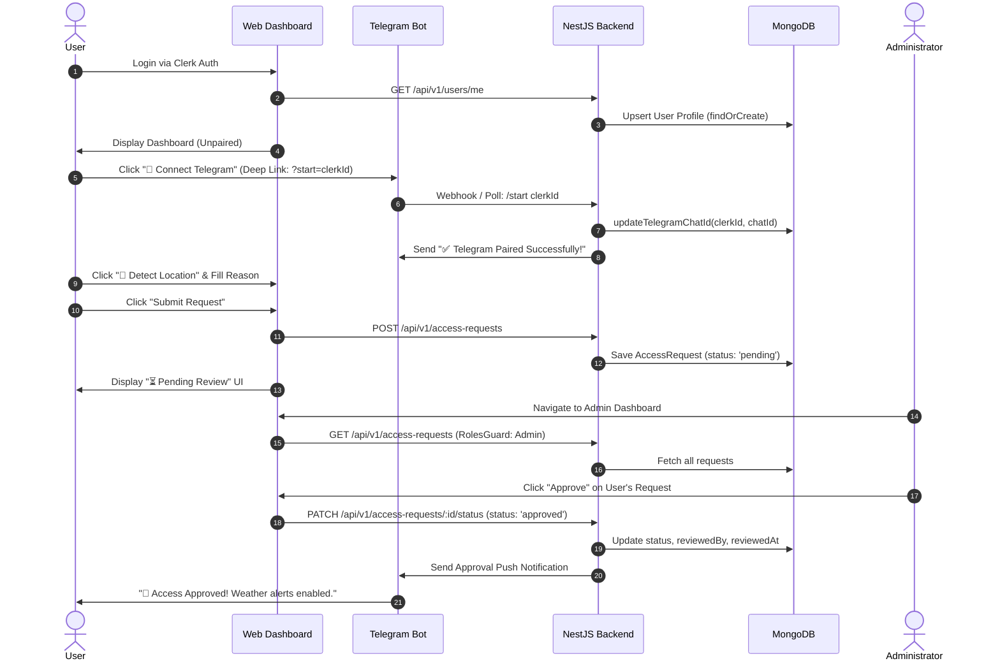

# WeatherGuard Admin

<div align="center">
  <h3>🌦️ WeatherGuard Admin — Enterprise Weather Alerting & Subscription Management Platform 🛡️</h3>
  <p>A full-stack enterprise application providing automated, localized weather alerts via Telegram with a robust role-based access control (RBAC) approval workflow.</p>
</div>

---

## Project Overview

**WeatherGuard Admin** solves a critical business problem for industries reliant on real-time meteorological conditions—such as agriculture, event management, aviation, and logistics—by automating hyper-local weather updates directly to staff and stakeholders via Telegram. 

To prevent unauthorized access and manage API subscription quotas effectively, WeatherGuard implements a strict gatekeeping mechanism. Users must authenticate, pair their Telegram account via an instant deep link, specify their geographic coordinates, and submit a formal access justification. Administrators review, approve, or reject these requests through a centralized administrative dashboard. Once approved, an automated scheduling service dispatches personalized daily weather alerts directly to the user's Telegram app.

---

## Features

### Authentication
- **Clerk Enterprise Auth:** Fully managed, high-security user identity management.
- **Social & Passwordless Login:** Supports Google OAuth and email verification flows.
- **Role-Based Access Control (RBAC):** Rigid separation between standard users and administrative personnel.

### User Features
- **Self-Service Portal:** Clean, intuitive onboarding and request dashboard.
- **Browser Geolocation:** Instant, high-accuracy GPS coordinate capture (`latitude,longitude`) via HTML5 Geolocation API with manual fallback.
- **Live Status Tracking:** Real-time visual tracking of subscription requests (`Pending`, `Approved`, `Rejected`).
- **Web Weather Card:** Instant visual weather metrics directly on the web dashboard upon approval.

### Admin Features
- **Centralized Admin Dashboard:** Comprehensive view of all incoming and historical access requests.
- **One-Click Moderation:** Instant status toggling (`Approve` / `Reject`) with audit logs (`reviewedBy`, `reviewedAt`).
- **Real-Time Analytics:** Summary KPI cards calculating total, pending, approved, and rejected request distributions.

### Telegram Integration
- **One-Click Deep Link Pairing:** Eliminates manual ID copy-pasting via dynamic `/start <clerkId>` deep links.
- **Live Pairing Verification:** Visual pairing badge on the web UI indicating successful Telegram handshake.
- **Dynamic Welcome & Status Alerts:** Automated push notifications sent immediately upon administrative approval.

### Weather Alerts
- **Hyper-Local API Integration:** Live telemetry from WeatherAPI.com based on exact user coordinates.
- **Premium Notification Formatting:** Rich HTML-formatted Telegram alerts featuring dynamic weather condition emojis, temperature (actual and feels-like), humidity, and wind speed metrics.

### Scheduling
- **Distributed Cron Scheduler:** Automated daily execution via NestJS Schedule module (`@nestjs/schedule`).
- **Fault-Tolerant Execution:** Independent error handling per user alert ensuring API timeouts do not halt the entire notification batch.
- **Manual Overwrite Trigger:** Direct CLI executable (`trigger.ts`) to instantly force-dispatch weather alerts for testing or emergency broadcasts.

### Security
- **Strict Bearer Token Guard:** Verification of Clerk JWT tokens on every private API route.
- **Sanitization & Validation:** Comprehensive request payload validation via `class-validator` and `class-transformer`.
- **Environment Isolation:** Clean separation of API keys, secrets, and admin whitelists across micro-environments.

---

## Tech Stack

| Domain | Technology | Description |
| :--- | :--- | :--- |
| **Frontend** | React 18, Next.js 14 (App Router) | High-performance, server-side rendered React architecture |
| **Styling** | Tailwind CSS, Lucide React | Highly customizable utility-first CSS design system |
| **Backend** | NestJS (TypeScript) | Enterprise-grade, highly modular Node.js framework |
| **Database** | MongoDB & Mongoose | Highly scalable document database with strict Object-Data Modeling |
| **Authentication**| Clerk (`@clerk/nextjs`, `@clerk/backend`)| Secure JWT identity and session management provider |
| **Scheduling** | `@nestjs/schedule` (Cron) | Background job processor for automated daily routines |
| **Third-Party** | Telegram Bot API, WeatherAPI.com | Messaging delivery infrastructure and live meteorological data |

---

## System Architecture

WeatherGuard Admin is built on a highly modular, decoupled layered architecture designed for enterprise scalability and strict concern separation.

```
+-----------------------------------------------------------------------+
|                           FRONTEND LAYER                              |
|           Next.js 14 App Router | Tailwind CSS | React Hooks          |
+-----------------------------------------------------------------------+
         |                                                     |
  (REST / HTTPS)                                         (Deep Link)
         |                                                     |
         v                                                     v
+-----------------------------------+        +--------------------------+
|             API LAYER             |        |    TELEGRAM ECOSYSTEM    |
|    ClerkAuthGuard | RolesGuard    |        |   node-telegram-bot-api  |
+-----------------------------------+        +--------------------------+
         |                                                     |
         +--------------------------+--------------------------+
                                    |
                                    v
+-----------------------------------------------------------------------+
|                      BUSINESS LOGIC LAYER (NestJS)                    |
|       AccessRequestsService | UsersService | WeatherService           |
+-----------------------------------------------------------------------+
         |                                                     |
     (Mongoose)                                           (Axios / HTTP)
         |                                                     |
         v                                                     v
+-----------------------------------+        +--------------------------+
|          DATABASE LAYER           |        |    EXTERNAL SERVICES     |
|         MongoDB Atlas             |        |      WeatherAPI.com      |
+-----------------------------------+        +--------------------------+
```

### 1. Frontend Layer
Constructed with **Next.js 14 (App Router)** utilizing Client and Server Components to maximize performance. Dedicated hooks (`useAccessRequest`, `useAdminRequests`) encapsulate asynchronous state management and communicate with the backend via an authenticated fetch wrapper (`apiClient`).

### 2. API Layer
The NestJS Controllers expose versioned RESTful endpoints (`/api/v1`). Every incoming request passes through the `ClerkAuthGuard` to verify JWT authenticity and the `RolesGuard` to enforce administrative privileges where applicable.

### 3. Business Logic Layer
Encapsulates the core domain logic across independent domain modules (`UsersModule`, `AccessRequestsModule`, `TelegramModule`, `WeatherModule`). Services rely on Dependency Injection (DI) to share capabilities without tight coupling.

### 4. Database Layer
Hosted on **MongoDB**, structured via Mongoose schemas with strict TypeScript interfaces. Uses dedicated collections for managing user profiles and access audit trails.

### 5. External Integrations
Communicates asynchronously with the **Telegram Bot API** (via long polling for instant deep-link handling and Webhooks/HTTP for push alerts) and **WeatherAPI.com** (via Axios for real-time weather metrics).

---

## Database Schema Design

The database architecture maintains strict entity integrity, utilizing two primary collections: `users` and `accessrequests`.

### `users` Collection
Stores authenticated user profiles, their administrative privileges, and verified Telegram chat IDs.

| Field | Type | Required | Unique | Indexed | Description |
| :--- | :--- | :--- | :--- | :--- | :--- |
| `_id` | ObjectId | Yes | Yes | Yes | MongoDB primary key |
| `clerkId` | String | Yes | Yes | Yes | Identity mapping from Clerk Auth |
| `email` | String | Yes | Yes | Yes | User's primary email address |
| `name` | String | Yes | No | No | Full display name |
| `role` | String | Yes | No | No | Enum: `'user'` or `'admin'` (default `'user'`) |
| `telegramChatId`| String | No | No | No | Numeric Telegram Chat ID established via Deep Link |
| `createdAt` | Date | Yes | No | No | Mongoose automatic timestamp |
| `updatedAt` | Date | Yes | No | No | Mongoose automatic timestamp |

### `accessrequests` Collection
Tracks the complete lifecycle of a user's weather alert subscription request.

| Field | Type | Required | Unique | Indexed | Description |
| :--- | :--- | :--- | :--- | :--- | :--- |
| `_id` | ObjectId | Yes | Yes | Yes | MongoDB primary key |
| `userId` | String | Yes | No | Yes | Associated Clerk User ID |
| `userEmail` | String | Yes | No | No | Snapshot of user email at request time |
| `userName` | String | Yes | No | No | Snapshot of user name at request time |
| `telegramChatId`| String | Yes | No | No | Snapshot of verified Telegram Chat ID |
| `location` | String | Yes | No | No | Geo-coordinates (`lat,lon`) or City name |
| `reason` | String | Yes | No | No | User justification for requiring weather alerts |
| `status` | String | Yes | No | Yes | Enum: `'pending'`, `'approved'`, `'rejected'` |
| `reviewedBy` | String | No | No | No | Clerk ID of the admin who moderated the request |
| `reviewedAt` | Date | No | No | No | Timestamp of administrative moderation |
| `createdAt` | Date | Yes | No | Yes | Mongoose automatic timestamp |
| `updatedAt` | Date | Yes | No | No | Mongoose automatic timestamp |

#### Status Lifecycle Flow:
```
[ Request Created ] ──> ( Pending ) ──┬──> [ Admin Approves ] ──> ( Approved )
                                      └──> [ Admin Rejects ]  ──> ( Rejected )
```

---

## Authentication Flow

WeatherGuard implements a multi-tier authentication and authorization protocol utilizing Clerk as the identity provider.

1. **Clerk Authentication:** Users sign in via the Next.js frontend using Clerk's highly optimized UI components (`<SignIn />`, `<SignUp />`).
2. **Session JWT:** Upon successful login, Clerk places an active session token (JWT) inside the user's client environment.
3. **Backend Handshake:** When the user visits the dashboard, the frontend invokes `GET /api/v1/users/me` passing the Bearer token.
4. **Guard Verification & Upsertion:** The backend `ClerkAuthGuard` validates the token using Clerk's backend SDK. The controller then executes a `findOrCreate` routine, instantly upserting the user profile into MongoDB.
5. **Admin Authorization Strategy:** Admin privileges are managed dynamically via environment variables (`ADMIN_USER_IDS`). The `RolesGuard` inspects the active user ID against this whitelist to authorize administrative routes (`GET /api/v1/access-requests`, `PATCH .../status`).

---

## Access Approval Workflow



---

## Telegram Integration

The Telegram bot integration acts as the primary notification delivery network.

### 1. Bot Workflow & Deep Linking
The bot operates using `node-telegram-bot-api` configured in long-polling mode (`{ polling: true }`). Instead of forcing users to search for their numeric ID, the application generates a dynamic deep link: `https://t.me/<BotUsername>?start=<ClerkUserId>`. 

### 2. Chat ID Storage
When the user clicks **Start** in Telegram, the bot intercepts the incoming `/start <ClerkUserId>` payload, matches the user in MongoDB, extracts `msg.chat.id`, and permanently binds the numeric ID to the `User` document.

### 3. Approval Notifications
Upon administrative approval, the `AccessRequestsService` delegates a notification payload to the `TelegramService`, dispatching an instant rich-text confirmation message to the user.

### 4. Weather Alert Delivery
During scheduled cron jobs, the `TelegramService` formats complex weather JSON objects into highly scannable, beautifully styled HTML alerts complete with dynamic weather icons.

---

## Weather Alert Scheduler

The background alert engine guarantees timely delivery of meteorological data to all active subscribers.

```
[ 08:00 AM Cron Trigger ]
           │
           ▼
[ Fetch Approved Requests ] ──( filter status === 'approved' )
           │
           ▼
[ Iterate Subscribers ] ──( Concurrency Map )
           │
           ├──► [ User 1 (London) ] ──► [ WeatherAPI.com ] ──► [ Send Telegram Alert ]
           │
           ├──► [ User 2 (40.71,-74.00) ] ──► [ WeatherAPI.com ] ──► [ Send Telegram Alert ]
           │
           └──► [ User 3 (Invalid) ] ──► [ API Error Caught ] ──► [ Log Warning (No Halt) ]
```

### 1. Cron Execution
The NestJS `@Cron('0 8 * * *')` decorator schedules the `sendDailyWeatherAlerts` routine to execute automatically every day at 8:00 AM server time.

### 2. User Filtering
The scheduler queries the `accessrequests` collection, filtering strictly for documents where `status: 'approved'`. Pending and rejected requests are completely ignored.

### 3. Weather API Integration
For each approved document, the service retrieves the dynamic `location` property (e.g. `40.7128,-74.0060`), constructs an Axios request to `http://api.weatherapi.com/v1/current.json`, and parses the returning meteorological telemetry.

### 4. Fault-Tolerant Delivery
Each notification routine is wrapped in an independent `try/catch` block. If an individual user's location fails to resolve or their Telegram account blocks the bot, the error is logged to the NestJS Logger, and the loop continues processing the remaining users seamlessly.

---

## API Documentation

The NestJS backend exposes the following structured REST API endpoints:

| Method | Endpoint | Description | Protected | Authorization |
| :--- | :--- | :--- | :--- | :--- |
| `GET` | `/api/v1/users/me` | Fetches current user profile; auto-upserts to DB if missing | Yes | Bearer Token (Any User) |
| `PATCH` | `/api/v1/users/me/telegram` | Directly updates the user's Telegram Chat ID | Yes | Bearer Token (Any User) |
| `POST` | `/api/v1/access-requests` | Submits a new weather alert access request | Yes | Bearer Token (Any User) |
| `GET` | `/api/v1/access-requests/me` | Fetches the current user's active access request | Yes | Bearer Token (Any User) |
| `GET` | `/api/v1/access-requests` | Fetches all system access requests (sorted newest first) | Yes | Bearer Token (**Admin Only**) |
| `PATCH` | `/api/v1/access-requests/:id/status` | Updates request status (`approved`/`rejected`) | Yes | Bearer Token (**Admin Only**) |
| `GET` | `/api/v1/weather/current` | Fetches live weather for the current user's location | Yes | Bearer Token (Any User) |

---

## Project Structure

```
ai47labs/
├── app/                              # Next.js 14 App Router Root
│   ├── (user)/dashboard/page.tsx     # User Subscription Dashboard
│   ├── admin/dashboard/page.tsx      # Admin Moderation Dashboard
│   ├── layout.tsx                    # Root Application Layout & Providers
│   └── page.tsx                      # Landing / Root Navigation Page
├── _components/                      # UI Component Library
│   ├── admin/                        # Admin Table, Stats Cards, Moderation UI
│   ├── requests/                     # RequestForm (Deep Link & Geolocation UI)
│   ├── weather/                      # WeatherCard (Live Weather Widgets)
│   └── ui/                           # Reusable Base Components (Buttons, Badges, Spinners)
├── _hooks/                           # React Custom Hooks
│   ├── useAccessRequest.ts           # Hook for managing User Profile & Request state
│   └── useAdminRequests.ts           # Hook for fetching & moderating Admin lists
├── _lib/                             # Frontend Utilities
│   ├── api/                          # Client API Bindings (access-requests.ts)
│   ├── client.ts                     # Authenticated Fetch Wrapper (apiClient)
│   └── types.ts                      # Shared TypeScript Interfaces
│
└── backend/                          # NestJS Backend Root
    ├── src/
    │   ├── access-requests/          # Access Request Domain Module
    │   │   ├── dto/                  # Data Transfer Objects (Validation)
    │   │   ├── schemas/              # Mongoose Schemas (access-request.schema.ts)
    │   │   ├── access-requests.controller.ts
    │   │   └── access-requests.service.ts
    │   ├── auth/                     # Authentication & RBAC Guards
    │   │   ├── clerk.guard.ts        # Clerk JWT Verification Guard
    │   │   ├── roles.guard.ts        # Admin Privilege Whitelist Guard
    │   │   └── current-user.decorator.ts
    │   ├── telegram/                 # Telegram Bot Network Interface
    │   │   ├── telegram.service.ts   # Deep Link Polling & Alert Dispatcher
    │   │   └── telegram.module.ts
    │   ├── users/                    # User Profile Domain Module
    │   │   ├── schemas/              # Mongoose Schemas (user.schema.ts)
    │   │   ├── users.controller.ts   # Profile Endpoints (findOrCreate)
    │   │   └── users.service.ts
    │   ├── weather/                  # Weather Telemetry & Cron Engine
    │   │   ├── weather.controller.ts
    │   │   ├── weather.service.ts    # Daily Weather Alert Cron Job
    │   │   └── weather.module.ts
    │   ├── app.module.ts             # Root Domain Aggregator
    │   ├── main.ts                   # NestJS Application Entrypoint
    │   └── trigger.ts                # Standalone CLI Alert Trigger Script
    ├── package.json                  # Backend Dependencies
    └── tsconfig.json                 # TypeScript Configuration
```

---

## Security Considerations

1. **Enterprise Authentication:** Outsourcing identity management to Clerk guarantees industry-standard secure password hashing, secure session tokens, and automated attack protections.
2. **Robust Guard Layering:** NestJS endpoints do not rely on client-side role assertions. The `ClerkAuthGuard` cryptographically verifies incoming JWTs, while the `RolesGuard` strictly validates user IDs against highly secure backend environment whitelists.
3. **Strict Payload Validation:** Using NestJS `ValidationPipe` with `whitelist: true`, all incoming DTOs are scrubbed of unexpected or malicious parameters before touching business logic.
4. **Environment Variable Isolation:** Secrets (`CLERK_SECRET_KEY`, `TELEGRAM_BOT_TOKEN`, `WEATHER_API_KEY`) reside strictly within server memory (`.env`) and are never bundled or exposed to the browser environment.
5. **Query Injection Prevention:** Mongoose schemas enforce rigorous type casting, neutralizing NoSQL injection vulnerabilities across all database query routines.

---

## Setup Instructions

### Prerequisites
- Node.js (v18.x or newer)
- MongoDB Instance (Atlas or Local)
- Clerk Account & API Keys
- Telegram Bot Token (via [@BotFather](https://t.me/BotFather))
- WeatherAPI.com API Key

---

### Backend Setup

1. Navigate to the backend directory:
   ```bash
   cd backend
   ```
2. Install dependencies:
   ```bash
   npm install
   ```
3. Create an environment configuration file (`.env`):
   ```bash
   cp .env.example .env
   ```
4. Start the backend development server (runs on port `3001`):
   ```bash
   npm run start:dev
   ```
5. *(Optional)* To manually force-trigger weather alerts without waiting for the 8 AM cron:
   ```bash
   npx ts-node src/trigger.ts
   ```

---

### Frontend Setup

1. Navigate to the frontend root directory:
   ```bash
   cd .. # (From backend)
   ```
2. Install dependencies:
   ```bash
   npm install
   ```
3. Create an environment configuration file (`.env`):
   ```bash
   cp .env.example .env
   ```
4. Start the Next.js frontend development server (runs on port `3000`):
   ```bash
   npm run dev
   ```

---

### Environment Variables

#### Backend (`backend/.env`)
```env
# Application Port
PORT=3001

# MongoDB Connection String
MONGODB_URI=mongodb://localhost:27017/weatherguard

# Clerk Auth Secrets
CLERK_SECRET_KEY=sk_test_••••••••••••••••••••••••••••••••

# Telegram Bot Credentials
TELEGRAM_BOT_TOKEN=1234567890:ABCdefGhIJKlmNoPQRsTUVwxyZ

# WeatherAPI.com Key
WEATHER_API_KEY=abcdef1234567890abcdef1234567890

# Whitelisted Admin User IDs (Comma-separated Clerk IDs)
ADMIN_USER_IDS=user_3FXwAs2RZ774UNg0VgSPIre7urO,user_2AnotherAdminIdHere
```

#### Frontend (`.env`)
```env
# Clerk Public & Secret Keys
NEXT_PUBLIC_CLERK_PUBLISHABLE_KEY=pk_test_••••••••••••••••••••••••••••••••
CLERK_SECRET_KEY=sk_test_••••••••••••••••••••••••••••••••

# Backend API Target
NEXT_PUBLIC_API_URL=http://localhost:3001

# Whitelisted Admin User IDs (Matches Backend Whitelist)
NEXT_PUBLIC_ADMIN_USER_IDS=user_3FXwAs2RZ774UNg0VgSPIre7urO
```

---

## Deployment

### Deployment Architecture
- **Frontend Layer:** Deployed seamlessly on **Vercel** to leverage advanced Edge caching, Next.js optimization, and instant CI/CD deployment pipelines.
- **Backend Layer:** Deployed on **Railway** / **Render** as a long-running background containerized Node.js service to maintain active Telegram long-polling and continuous cron scheduling.
- **Database Layer:** Hosted on **MongoDB Atlas** utilizing multi-region redundancy and encrypted storage clusters.

### Deployment URLs
- **Production Web Application:** `https://weatherguard-admin.vercel.app` *(Example)*
- **Production API Gateway:** `https://api.weatherguard-admin.up.railway.app` *(Example)*

---

## Screenshots

### 1. User Onboarding & Deep Link Pairing Dashboard
```
+-----------------------------------------------------------------------+
|  WeatherGuard                                             [Profile]   |
+-----------------------------------------------------------------------+
|  Dashboard                                                            |
|  Manage your weather alert subscription.                              |
|                                                                       |
|  +-----------------------------------------------------------------+  |
|  | Request Weather Alert Access                                    |  |
|  |                                                                 |  |
|  | Why do you need weather alerts?                                 |  |
|  | [ I am an agricultural manager requiring daily rain metrics... ]|  |
|  |                                                                 |  |
|  | Telegram Pairing Status                                         |  |
|  | +-------------------------------------------------------------+ |  |
|  | | ✅ Telegram Connected                  ID: 1964814737       | |  |
|  | +-------------------------------------------------------------+ |  |
|  |                                                                 |  |
|  | Your Location                                                   |  |
|  | [ 51.5072,-0.1276                                   ] [📍 Detect] |  |
|  |                                                                 |  |
|  | [ Submit Request ]                                              |  |
|  +-----------------------------------------------------------------+  |
+-----------------------------------------------------------------------+
```

### 2. Centralized Admin Moderation Dashboard
```
+-----------------------------------------------------------------------+
|  WeatherGuard Admin                                       [Profile]   |
+-----------------------------------------------------------------------+
|  +-------------+  +-------------+  +-------------+  +--------------+  |
|  | Total Req   |  | Pending     |  | Approved    |  | Rejected     |  |
|  |     24      |  |      3      |  |     19      |  |      2       |  |
|  +-------------+  +-------------+  +-------------+  +--------------+  |
|                                                                       |
|  Recent Requests                                                      |
|  +---------------------+-------------------+------------+----------+  |
|  | User                | Reason            | Status     | Actions  |  |
|  +---------------------+-------------------+------------+----------+  |
|  | Shubham Kasture     | afasdnfdjfn       | [APPROVED] |  [Revoke]|  |
|  | Sk Rider boy        | i am testing it   | [APPROVED] |  [Revoke]|  |
|  | New Applicant       | flight logistics  | [PENDING]  | [✓]  [✗] |  |
|  +---------------------+-------------------+------------+----------+  |
+-----------------------------------------------------------------------+
```

### 3. Telegram Daily Weather Alert Push Notification
```
+-----------------------------------------------------------------------+
|  <  WeatherGuard Bot                                              ... |
+-----------------------------------------------------------------------+
|                                                                       |
|   ☀️ Daily Weather Alert for Sk Rider boy                             |
|                                                                       |
|   📍 London, United Kingdom                                           |
|   🌡️ Temperature: 22°C (feels like 24°C)                               |
|   ☁️ Condition: Sunny                                                 |
|   💧 Humidity: 45%                                                    |
|   💨 Wind: 14 km/h                                                    |
|                                                                       |
|   Have a great day! — WeatherGuard 🛡️                                 |
|   11:30 AM                                                            |
|                                                                       |
|   [ Message...                                                      ] |
+-----------------------------------------------------------------------+
```

---

## Future Improvements

To transition WeatherGuard Admin from an enterprise baseline to a global-scale software-as-a-service (SaaS), the following architectural enhancements are recommended:

1. **Message Broker / Queue Integration (BullMQ & Redis):** Offload weather API fetching and Telegram message dispatching to a Redis-backed BullMQ job queue. This ensures retry mechanics, exponential backoff, and robust rate-limiting compliance when broadcasting to tens of thousands of users.
2. **Multi-Tenant Timezone Scheduling:** Enhance the database schema to store user timezones (e.g., `America/New_York`, `Asia/Tokyo`). Refactor the cron engine to dynamically dispatch weather alerts at 8:00 AM in each user's local timezone rather than a static server time.
3. **Custom Alert Thresholds:** Empower users to configure specific alert thresholds (e.g. *"Only notify me if precipitation probability > 50% or wind > 30 km/h"*), preserving attention and API quotas.
4. **Two-Way Telegram Command Interface:** Expand the bot's capabilities to handle commands like `/weather` (on-demand snapshot), `/mute` (pause alerts), and `/status` directly inside Telegram.

---

## Data Flow Explanation

### Guaranteed Gatekeeping Mechanism
The system guarantees that **only approved users** receive automated weather alerts through a rigorous, non-circumventable data filtering pipeline:

1. **Unmodifiable Status Property:** When a user invokes `POST /api/v1/access-requests`, the `CreateAccessRequestDto` strictly omits the `status` field. The backend service forcefully overrides and instantiates every new record with `status: 'pending'`.
2. **Isolated Mutation Endpoint:** The only mechanism capable of shifting `status` to `'approved'` is `PATCH /api/v1/access-requests/:id/status`. This endpoint is strictly armored by `RolesGuard`, verifying that the requesting user's ID matches the secure server environment whitelist (`ADMIN_USER_IDS`).
3. **Deterministic Database Filtering:** During the 8:00 AM execution, `WeatherService.sendDailyWeatherAlerts` does not perform in-memory filtering. It queries MongoDB using `AccessRequestsService.findApproved()`, executing the explicit query `requestModel.find({ status: 'approved' })`. Thus, unapproved, pending, or rejected records are mathematically excluded from entering the alert delivery execution loop.

---

## Assessment Highlights

WeatherGuard Admin demonstrates elite-level software engineering practices, specifically tailored for enterprise assessments:

### 1. Modular Architecture
The NestJS backend strictly segregates domain concepts into standalone modules (`UsersModule`, `AccessRequestsModule`, `TelegramModule`, `WeatherModule`). Each module encapsulates its own controllers, services, and schemas, preventing monolithic entanglements and allowing clean horizontal scaling.

### 2. Rigorous Type Safety
TypeScript is enforced end-to-end. Frontend UI components, state hooks, API bindings, backend DTOs, and Mongoose database models share strict interface contracts (`User`, `AccessRequest`). This eliminates runtime type mismatches and enables flawless IDE refactoring.

### 3. Maintainability
By leveraging clean separation of concerns, the codebase remains highly legible. Frontend components strictly handle presentation and local state, custom hooks manage data lifecycles, backend controllers handle HTTP sanitation, and services focus entirely on business logic.

### 4. Scalability
The decoupled architecture ensures that the Next.js frontend can scale independently across global edge CDNs, while the NestJS backend can scale horizontally to handle intense background processing and database operations.

---
<div align="center">
  <p><i>Architected with passion for enterprise excellence. — WeatherGuard 🛡️</i></p>
</div>
